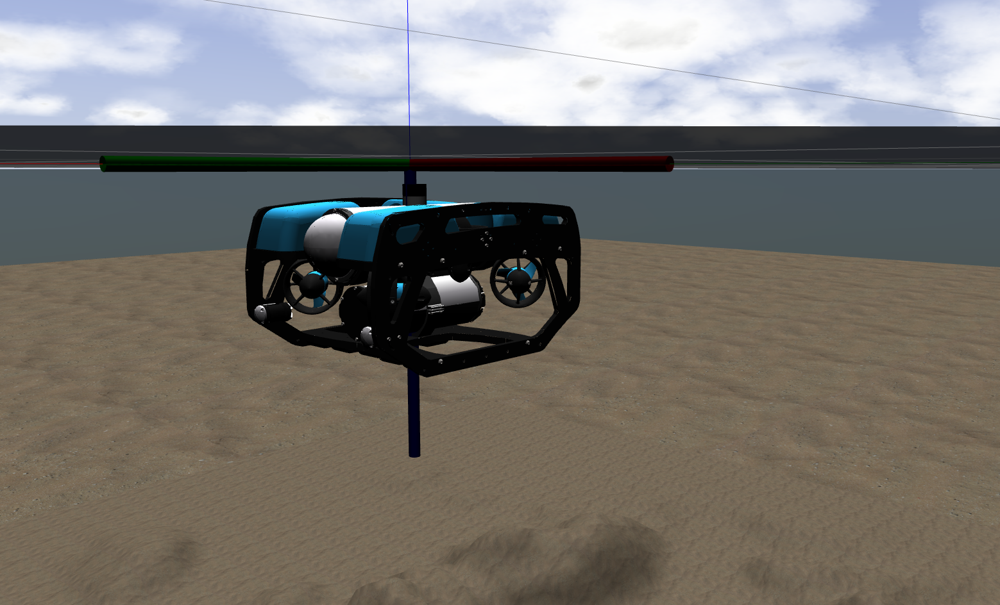
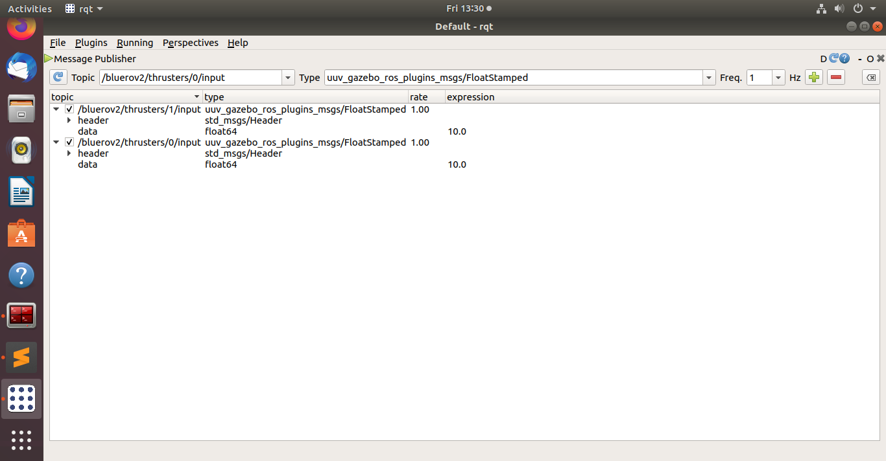

# BlueROV2 ROS Simulation

This repository contains the robot description and necessary launch files to
simulate the BlueROV2 (unmanned underwater vehicle) on [Unmanned Underwater Vehicle Simulator (UUV Simulator)](https://github.com/uuvsimulator/uuv_simulator). Additional it's possible run BlueROV2 in SITL using [mavros](http://wiki.ros.org/mavros), joystick interaction and video streaming capture with opencv based on [bluerov_ros_playground](https://github.com/patrickelectric/bluerov_ros_playground) package from BlueRobotics.

This work is in development at [Ingeniarius, Lda.](http://ingeniarius.pt/) and [Instituite of Systems and Robotics University of Coimbra](https://www.isr.uc.pt/) within the scope of MS thesis "Localization of an unmanned underwater vehicle using multiple water surface robots, multilateration, and sensor data fusion".

This package was forked from https://github.com/fredvaz/bluerov2, and ported to ROS melodic.
<p align="center">
  
</p>

The control of the uuv will be done through simulink; you can find the simulink solution in ./bluerov2_control/MatlabSrc. Do not forget to set your Ros master node ip correctly and tune the pid parameters. The simulink solution used both Ros and control toolbox.

## Requirements

- git
- [ros-\*-desktop-full](http://wiki.ros.org/ROS/Installation)
  - kinetic or newer
- [mavros](http://wiki.ros.org/mavros)
- python
  - opencv_python
  - numpy
  - [gi, gobject](https://wiki.ubuntu.com/Novacut/GStreamer1.0)
  - PyYAML
- [UUV Simulator](https://uuvsimulator.github.io/)


## Installation 

Clone this package in the `src` folder of you catkin workspace

```
cd ~/catkin_ws/src
https://github.com/UUVControl/bluerov2.git
```

and then build your catkin workspace

```bash
cd ~/catkin_ws
catkin_make # or <catkin build>, if you are using catkin_tools
```


## Running with UUV Simulator

To run a demonstration with the vehicle, you can run a UUV
simulator Gazebo scenario, such as

```bash
roslaunch uuv_gazebo_worlds  ocean_waves.launch
```

and then

```bash
roslaunch bluerov2_description upload_bluerov2.launch
```


To publish a Ros message on the input topic of one of the thrusters, summon rqt

```bash
rqt
```

And as shown search for one of the thrusters' input and modify the values for pwm.

<p align="center">
  
</p>
## Running with SITL 
- Run ArduPilot SITL

    1. [Download ArduPilot and configure SITL](http://ardupilot.org/dev/docs/setting-up-sitl-on-linux.html).
    2. `$ cd ardupilot/ArsuSub`
    3. `$ sim_vehicle.py`
    4. `$ roslaunch bluerov2_gazebo start_ardusub_sitl_demo.launch`

  
- Fake video stream

    - `$ gst-launch-1.0 videotestsrc ! video/x-raw,width=640,height=480 ! videoconvert ! x264enc ! rtph264pay ! udpsink host=127.0.0.1 port=5600`
        - If necessary, change video source and resolution.
        - To test the udp reception: `gst-launch-1.0 -v udpsrc port=5600 ! application/x-rtp, payload=96 ! rtpjitterbuffer ! rtph264depay ! avdec_h264 ! fpsdisplaysink sync=false text-overlay=false`


## Topics

If you need more information about the topics and what you can access, take a look [here](doc/topics_and_data.md).


## License

BlueROV2 package is open-sourced under the Apache-2.0 license. See the
[LICENSE](LICENSE) file for details.
